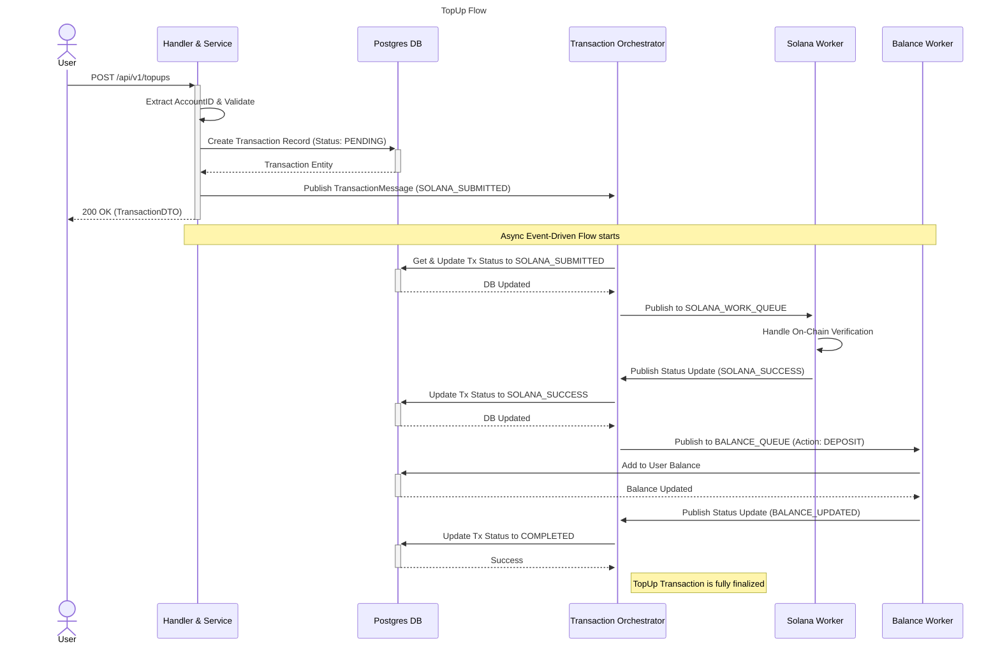
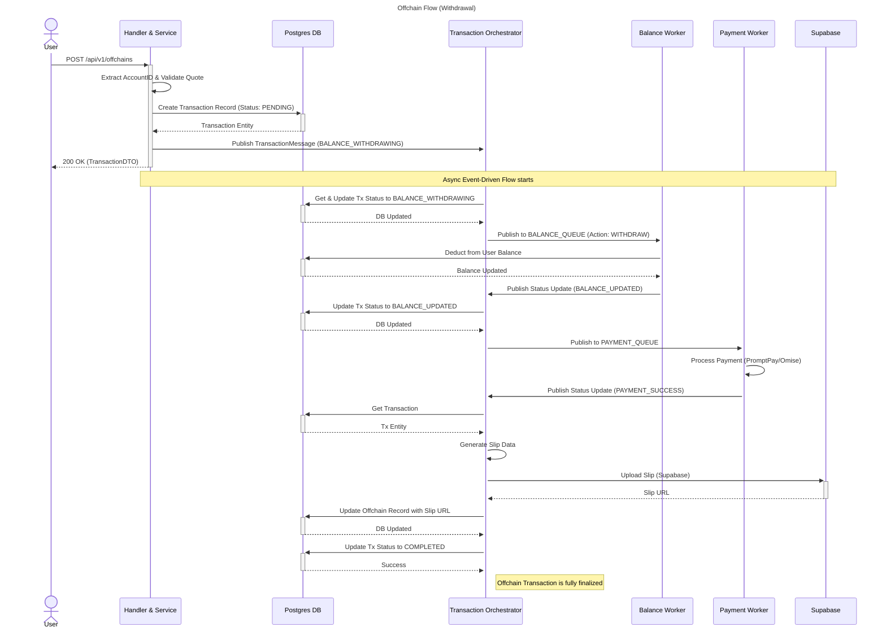

# solpay-core-service

```
PORT=8080
DB_HOST=localhost
DB_PORT=5432
DB_USER=solpay_user
DB_PASSWORD=solpay_password
DB_NAME=solpay_db
```

### TopUp Flow (Event-Driven)



### Offchain Flow (Event-Driven)


